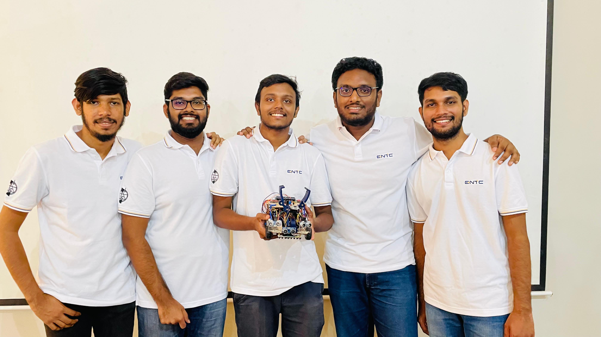
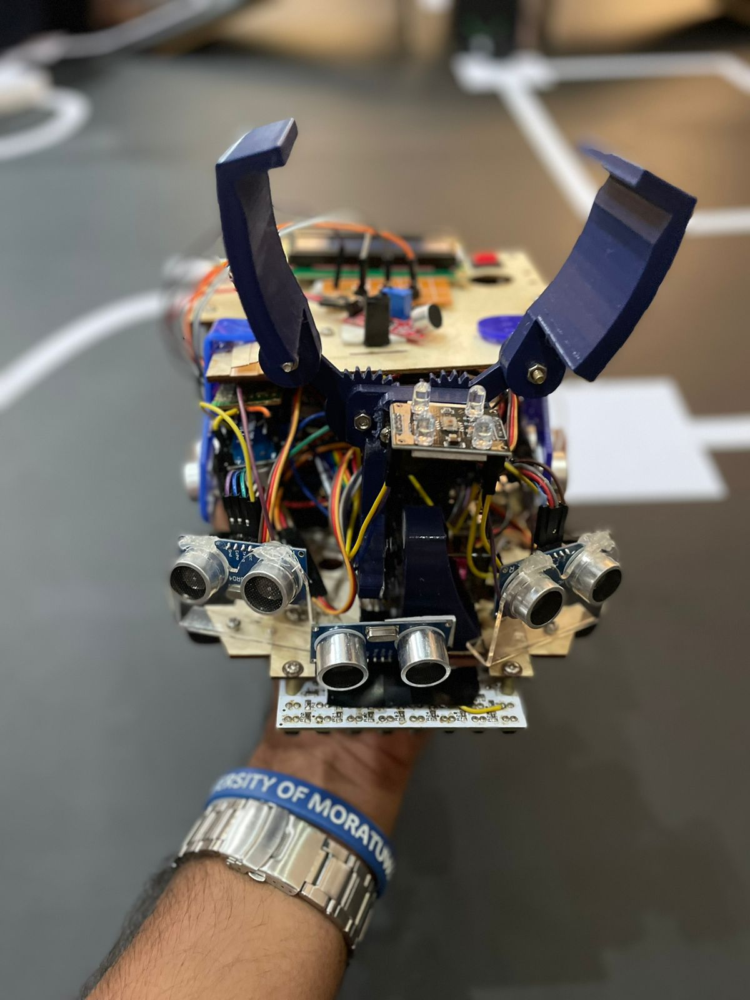

# Robot Design for EN2553 Module Competetion

This project was completed for the Semester 3 Robotics Design and Competition module of the Department of Electronic and Telecommunication Engineering, University of Moratuwa.

## Our Team

Our team, "The Titans" consists of:

🌟 Sahan Dissanayaka  
🌟 Senum Dodangoda  
🌟 Sandaru Liyanaarachchi  
🌟 Pasindu Kulasingham  
🌟 Dilshan Nuwantha  

## Our Robot

## Our Task

For detailed information about our task, please refer to the attached PDF document.

[Download Task PDF](Robotic_Task_version_1_1-8.pdf)

## Project Objectives

- Line following 
- Wall avoidance 
- Ramp navigation (20 degrees) 
- Object interaction 
- Sound sensitivity 
- Color detection 
- Maze traversal 
- Obstacle evasion (even against guard robots) 

## Team Achievements

👏 Each member conquered challenges, turning them into triumphs! 🌟 Get ready to witness the Titan Robot revolution! 🚀🤖
